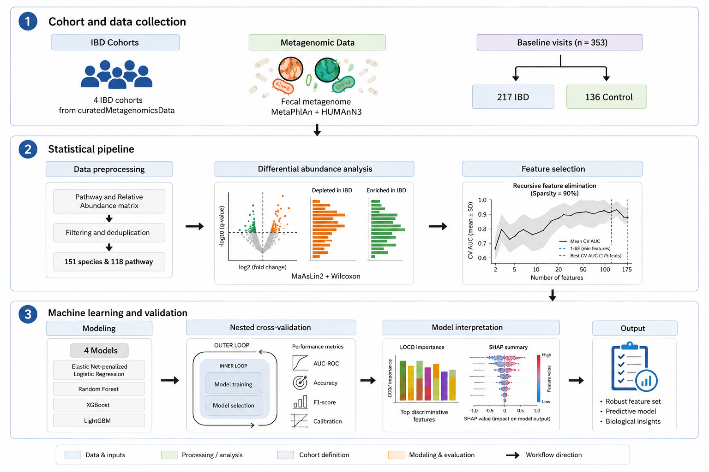
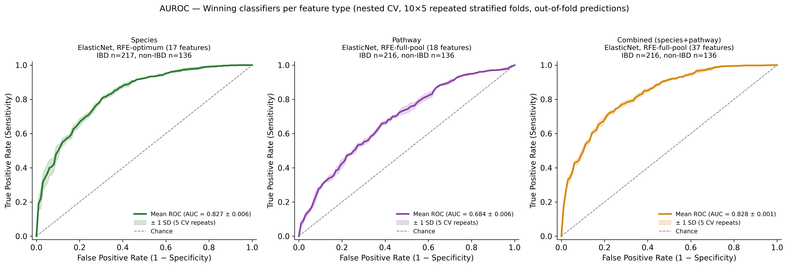

# IBD Cross-Cohort Microbiome Classification Pipeline




A Snakemake-orchestrated, R + Python pipeline classifying inflammatory bowel disease (IBD) status from gut microbiome composition, pooled across 4 independent, publicly available cohorts from curatedMetagenomicData.


**Full write-up, methods, and results: https://sanyukta2002.github.io/ML-ibd/**

## Overview

Cohort structure (sequencing center, geography, population) is often a stronger driver of microbiome composition than disease status itself, so cross-cohort microbial signatures frequently fail to replicate. This pipeline is built specifically to address that: it explicitly tests for and accounts for cohort-driven variance, requires agreement across three independent statistical tests before trusting any differentially abundant feature, and validates every machine learning model with leave-one-cohort-out (LOCO) testing -- not just standard pooled cross-validation.

**Cohorts:** HMP_2019_ibdmdb, HallAB_2017, IjazUZ_2017, NielsenHB_2014 (ESP subjects only). 353 pooled samples (217 IBD, 136 control), baseline visit only per subject.

## Key Results




| Feature type | Best model / panel | Pooled AUROC | Mean LOCO AUROC |
|---|---|---|---|
| Species | ElasticNet, RFE-optimum (17 features) | 0.833 | 0.806 |
| Pathway | ElasticNet, RFE-full-pool (18 features) | 0.692 | 0.581 |
| Combined (species + pathway) | ElasticNet, RFE-full-pool (37 features) | 0.828 | 0.813 |

**Headline finding:** species-level composition drives nearly all of the classifiable signal and generalizes reasonably well across held-out cohorts. Pathway-level functional data shows a real statistical association in pooled analysis but its predictive power collapses under LOCO validation (mean AUROC 0.581, and below chance on one held-out cohort) -- evidence the apparent pathway signal is substantially cohort-specific rather than genuinely generalizable. Confirmed independently via SHAP: species features carry 88.3% of the combined model's total feature importance.

Full results, all figures, and methodological detail: https://sanyukta2002.github.io/ML-ibd/results.html

## Reproducibility

The full pipeline was independently verified via a clean-room test: a fresh clone, both environments rebuilt entirely from tracked recipe files with no manual intervention, and the complete pipeline run unattended end-to-end -- output compared byte-for-byte against the original run and found identical. Full verification details: [REPRODUCIBILITY.md](REPRODUCIBILITY.md).

### Reproducing this pipeline

**Prerequisites:** access to an HPC cluster with SLURM, Apptainer/Singularity, and conda/mamba.

**1. Clone this repository:**

```bash
git clone https://github.com/Sanyukta2002/ML-ibd.git
cd ML-ibd
```

**2. Build the R environment** — pull the Apptainer container, then install the R/Bioconductor package set inside it:

```bash
apptainer pull envs/bioconductor.sif docker://bioconductor/bioconductor_docker:RELEASE_3_19

mkdir -p envs/r_libs
apptainer exec --bind $(pwd):/proj --env R_LIBS_USER=/proj/envs/r_libs \
  envs/bioconductor.sif Rscript /proj/scripts/r/setup/install_r_packages.R
```

**3. Build the Python environment** (exact pinned versions):

```bash
mamba env create -p envs/python_ml -f envs/python_ml.yml
```

**4. Edit `config/slurm_profile/config.yaml`** — the one file that legitimately needs a manual, site-specific edit (your own SLURM account, partition, and container bind paths). Every other path in the codebase is relative/config-driven and requires no editing.

**5. Start the MLflow tracking server:**

```bash
bash scripts/start_mlflow_server.sh
```

**6. Run the full pipeline** (raw cohort pull through combined ML sweeps and LOCO validation, unattended):

```bash
snakemake --workflow-profile config/slurm_profile
```

## Repository Structure

- config/config.yaml -- every threshold, parameter, and path used by the pipeline, centralized
- config/slurm_profile/ -- cluster execution config (site-specific, see Reproducibility above)
- Snakefile, rules/ -- pipeline orchestration; one .smk file per stage (species, pathway, ML/LOCO)
- scripts/r/ -- R pipeline: cohort selection through RFE panel selection, species and pathway
- scripts/python/ -- Python pipeline: CLR transform, nested-CV ML sweeps, LOCO validation, SHAP
- envs/ -- R container definition (envs/r_bioconductor.def) + pinned Python environment spec (envs/python_ml.yml)
- results/tables/ -- small, git-tracked summary tables (the audit trail: filtering funnels, hit counts, ML leaderboards, LOCO summary)
- results/ml_results/, results/loco/ -- per-model/per-panel result markers and summaries
- docs/ -- Quarto source for the published documentation site (https://sanyukta2002.github.io/ML-ibd/)
- REPRODUCIBILITY.md -- the clean-room verification writeup

## Data Source

All cohort data via curatedMetagenomicData (Pasolli et al. 2017, Nature Methods), a Bioconductor package providing pre-processed, publicly available shotgun metagenomic sequencing data (MetaPhlAn species-level and HUMAnN pathway-level abundance).
