## 1. Cohort structure dominates over disease status — and we account for it

Before trusting any disease-association result, the pipeline first asked how much of the microbial compositional variance is explained by cohort of origin versus IBD status. The answer, consistently across both feature types and across every covariate-adjusted submodel: **cohort explains roughly 6–13× more variance than IBD group.**

::: {#fig-permanova}
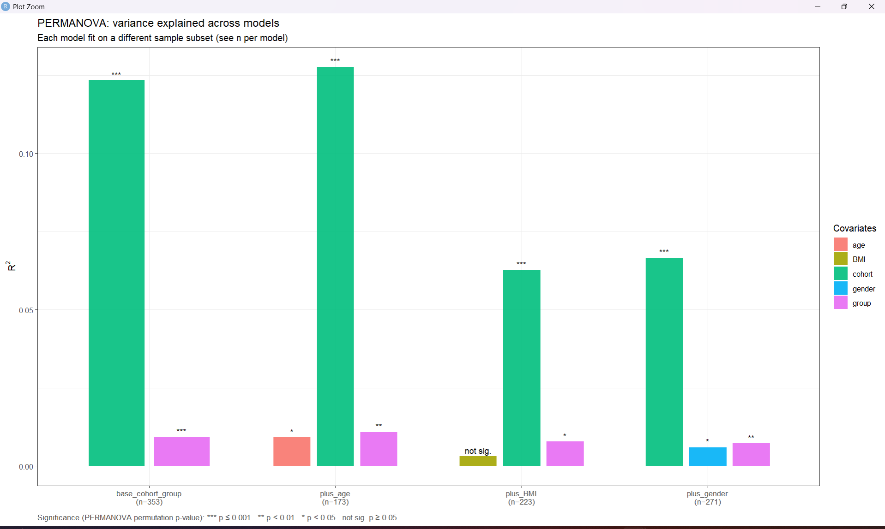

PERMANOVA (Bray-Curtis, `by="margin"`) variance explained (R²) across four models, each fit on a different sample subset depending on covariate availability. `cohort` (green) dwarfs `group` (magenta) in every model; `age` and `gender` are independently significant but small; `BMI` is never significant.
:::

| Model | n | cohort R² | group R² | covariate R² |
|---|---:|---:|---:|---:|
| base (cohort + group), species | 353 | 0.1233 (p=0.001) | 0.0093 (p=0.001) | — |
| base (cohort + group), pathway | 352 | 0.1298 (p=0.001) | 0.0105 (p=0.002) | — |
| + age, species | 173 | 0.1276 (p=0.001) | 0.0108 (p=0.008) | age 0.0091 (p=0.031) |
| + age, pathway | 173 | 0.1259 (p=0.001) | 0.0131 (p=0.006) | age 0.0035 (p=0.611, n.s.) |
| + gender, species | 271 | 0.0665 (p=0.001) | 0.0072 (p=0.008) | gender 0.0059 (p=0.037) |
| + gender, pathway | 271 | 0.0722 (p=0.001) | 0.0107 (p=0.007) | gender 0.0051 (p=0.152, n.s.) |
| + BMI, species | 223 | 0.0627 (p=0.001) | 0.0078 (p=0.018) | BMI 0.0031 (p=0.777, n.s.) |
| + BMI, pathway | 223 | 0.0661 (p=0.001) | 0.0097 (p=0.026) | BMI 0.0055 (p=0.204, n.s.) |

*Source: `results/tables/step6_permanova_summary.csv`, `step_pathway_permanova_summary.csv`.*

The corresponding ordination confirms this visually: cohorts separate along PCoA1/PCoA2 far more clearly than IBD vs. control does within any single cohort (circle vs. triangle shapes are thoroughly intermixed within each cohort's ellipse).

::: {#fig-pcoa}
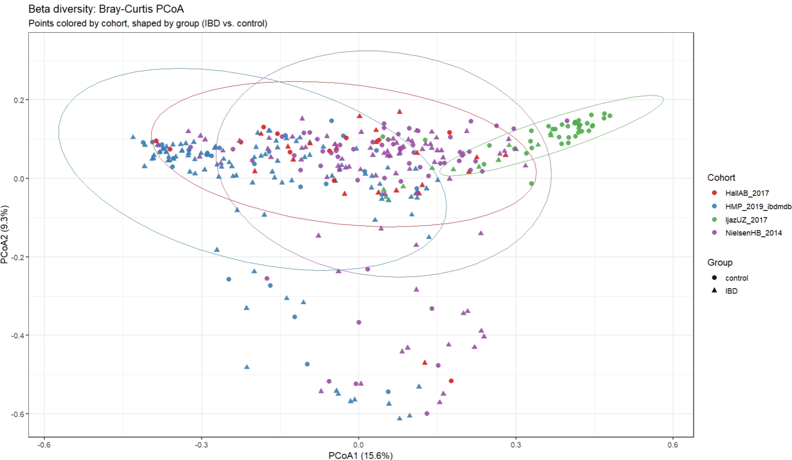

Bray-Curtis PCoA, species-level, colored by cohort and shaped by group. PCoA1 explains 15.6% of variance, PCoA2 9.3%. IjazUZ_2017 (green) is the most visually distinct cohort.
:::

**Practical consequence for everything downstream:** the blocked Wilcoxon test explicitly blocks on cohort; both MaAsLin2 tiers include cohort as a random effect; and the ML validation strategy includes leave-one-cohort-out testing specifically because pooled cross-validation alone cannot rule out a model that has learned cohort identity rather than IBD biology.

## 2. Alpha diversity: significant in species, not in pathway

Species-level alpha diversity is significantly reduced in IBD across all three metrics; pathway-level (functional) alpha diversity shows **no significant difference** — an important and genuine divergence between the taxonomic and functional layers, not an oversight.

::: {#fig-alpha}
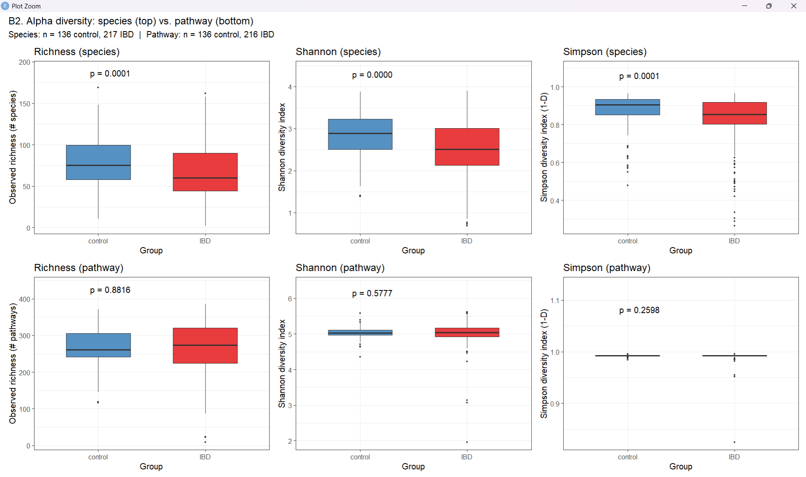

Alpha diversity, species (top row) vs. pathway (bottom row). Species: richness p=0.0001, Shannon p<0.0001, Simpson p=0.0001 (Wilcoxon, unadjusted). Pathway: richness p=0.882, Shannon p=0.578, Simpson p=0.260 — none significant.
:::

| Metric | Species Wilcoxon p (unadj.) | Species LME p (cohort-adj.) | Pathway Wilcoxon p (unadj.) | Pathway LME p (cohort-adj.) |
|---|---:|---:|---:|---:|
| Shannon | 6.91×10⁻⁶ | 0.0021 | 0.578 | 0.898 |
| Simpson | 8.59×10⁻⁵ | 0.0432 | 0.260 | 0.362 |
| Richness | 6.87×10⁻⁵ | 0.00022 | 0.882 | 0.802 |

*Source: `results/tables/step7_diversity_test_summary.csv`, `step_pathway_diversity_test_summary.csv`. The species result survives cohort-adjustment (LME), confirming it is not purely a cohort-composition artifact.*

## 3. Differential abundance: three independent tests, species vs. pathway

The species layer shows a strong, consistent differential-abundance signal across all three tests; the pathway layer shows a striking **divergence** between MaAsLin2 (almost no hits) and the blocked Wilcoxon test (many hits) — a finding worth featuring on its own.

::: {#fig-da-summary}
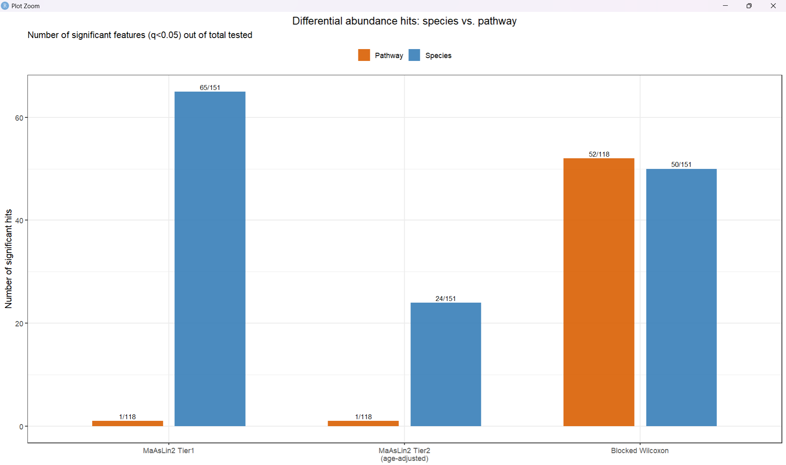

Significant feature counts (q<0.05) out of total tested, species (blue) vs. pathway (orange), across all three DA tests.
:::

| Test | Species hits / tested | Pathway hits / tested |
|---|---:|---:|
| MaAsLin2 Tier 1 (all samples, n=353/352) | 65 / 151 | 1 / 118 |
| MaAsLin2 Tier 2 (age-adjusted, n=173) | 24 / 151 | 1 / 118 |
| Blocked Wilcoxon (cohort-blocked) | 50 / 151 | 52 / 118 |

*Source: `step8_maaslin2_tier1_hit_summary.csv`, `step9_maaslin2_tier2_hit_summary.csv`, `step12_wilcoxon_hit_summary.csv` and pathway equivalents.* The pathway MaAsLin2 models are effectively null (1/118 in both tiers) while the pathway blocked Wilcoxon test finds nearly half the tested pathways significant (52/118) — a large discrepancy between a mixed-model and a rank-based, cohort-blocked non-parametric test on the same data, worth treating as a genuine methodological finding rather than picking one number to report.

### Species — Tier 1 and Tier 2 volcano plots

::: {#fig-volcano-t1}
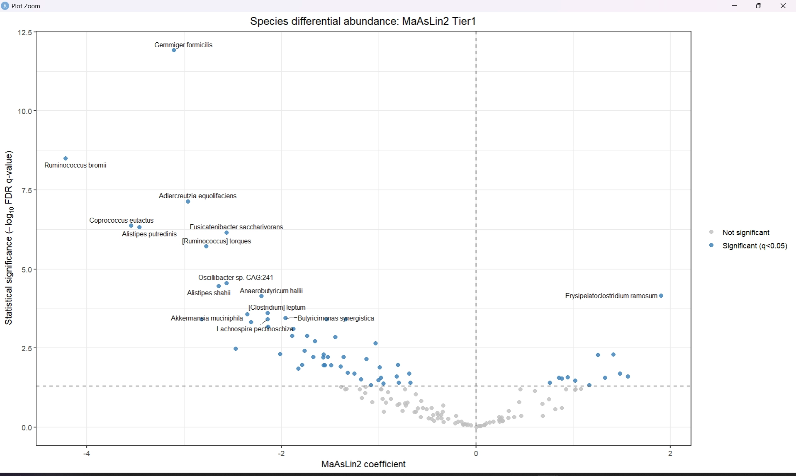

Species differential abundance, MaAsLin2 Tier 1 (all 353 samples). *Gemmiger formicilis* and *Ruminococcus bromii* are the two strongest depleted-in-IBD hits; *Erysipelatoclostridium ramosum* is the strongest enriched-in-IBD hit.
:::

::: {#fig-volcano-t2}
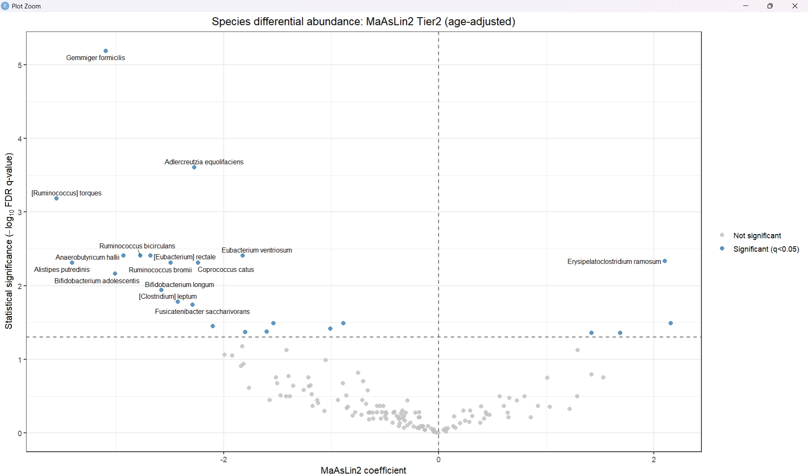

Species differential abundance, MaAsLin2 Tier 2 (age-adjusted subset, n=173). The same top hits (*Gemmiger formicilis*, *Ruminococcus bromii*, *Adlercreutzia equolifaciens*, *Erysipelatoclostridium ramosum*) remain significant after adjusting for age and restricting to the smaller age-available subset — direct evidence the Tier 1 signal is not simply an age confound.
:::

::: {#fig-volcano-wilcox}
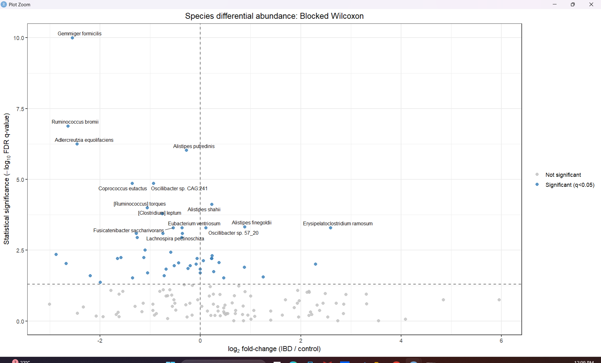

Species differential abundance, cohort-blocked Wilcoxon test. Same top hits again — three independently-specified tests converge on the same leading species.
:::

### Pathway — blocked Wilcoxon significant features

Every one of the 52 pathways significant by the blocked Wilcoxon test is **lower in IBD** — no pathway shows significant enrichment. This one-directional pattern (loss of function, not gain) is consistent across nearly all detected pathways, in contrast to species, where both depletion and enrichment hits exist.

::: {#fig-pathway-wilcox}
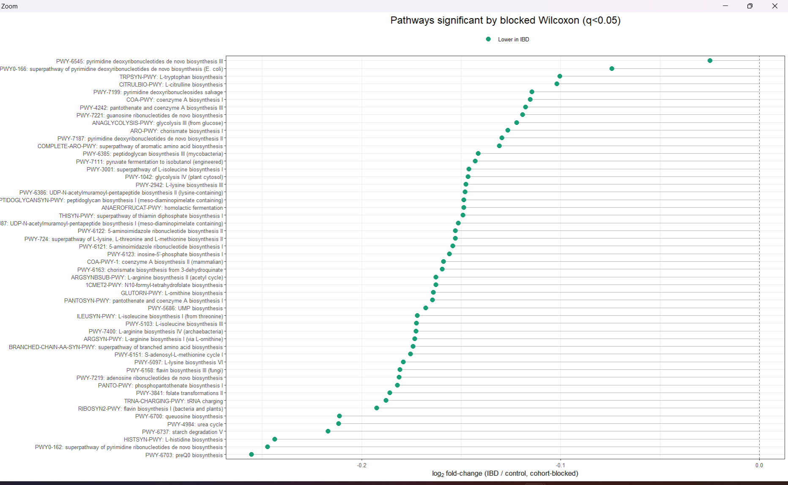

Pathways significant by blocked Wilcoxon (q<0.05), ranked by log₂ fold-change (IBD/control, cohort-blocked). All are depleted in IBD.
:::

### 3-way convergence and the validated species signature

Requiring agreement across MaAsLin2 Tier 1, MaAsLin2 Tier 2, and the blocked Wilcoxon test — the pipeline's core evidentiary bar — leaves **19 species** as fully validated ("triple-candidates"), out of 65 Tier-1 hits.

::: {#fig-venn}
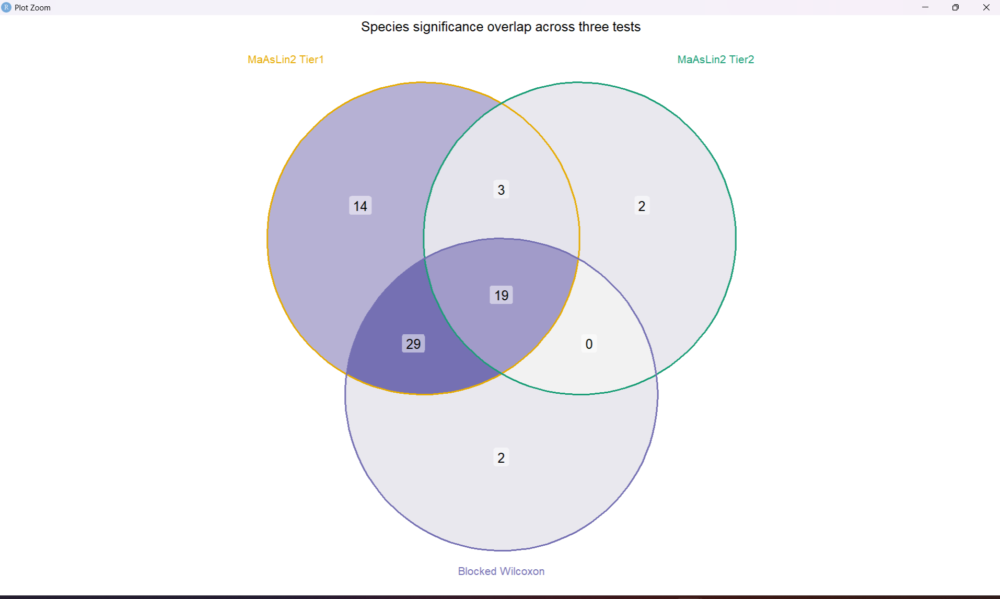

3-way overlap of species significance: MaAsLin2 Tier1, MaAsLin2 Tier2, and blocked Wilcoxon. 19 species pass all three tests; 29 pass Tier1+Wilcoxon but not the smaller-sample Tier2; only 2 pass Wilcoxon alone.
:::

Of the 19 triple-candidates, **17 are depleted in IBD and 2 are enriched** (*Erysipelatoclostridium ramosum*, *[Clostridium] symbiosum*) — both flagged as notable in Ning et al. 2023 as well [@ning2023ccia]. The signature is dominated by short-chain-fatty-acid-associated commensals (*Gemmiger formicilis*, *Ruminococcus bromii*, *Fusicatenibacter saccharivorans*, *[Eubacterium] rectale*).

::: {#fig-triple}
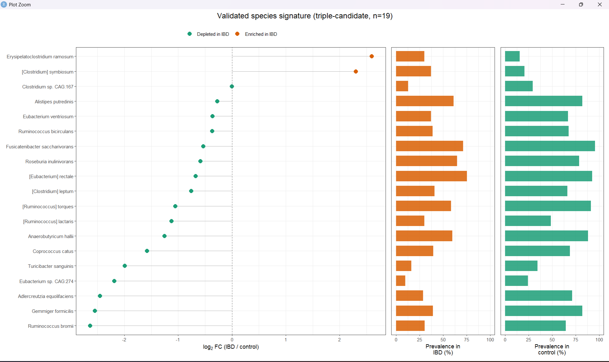

The 19-species triple-candidate signature, ranked by log₂ fold-change, with prevalence in IBD vs. control shown alongside. Most depleted species (green) show markedly lower prevalence in IBD than in control; the two enriched species (orange) show the reverse pattern.
:::

For reference, the full landscape of all 65 MaAsLin2-Tier1-significant species (i.e., before requiring 3-way agreement) is shown below — useful for seeing which additional species show a directionally consistent but less-replicated signal:

::: {#fig-full-landscape}
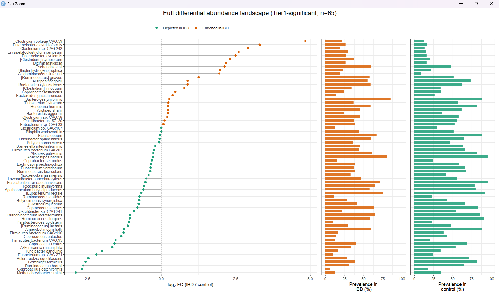

All 65 species significant in MaAsLin2 Tier 1, ranked by log₂ fold-change, with IBD/control prevalence bars.
:::

## 4. Feature selection: RFE panels

The 19-species and 18-pathway triple-candidate pools were reduced further via Recursive Feature Elimination, producing three panels each (optimum / parsimony / full pool):

::: {#fig-rfe}
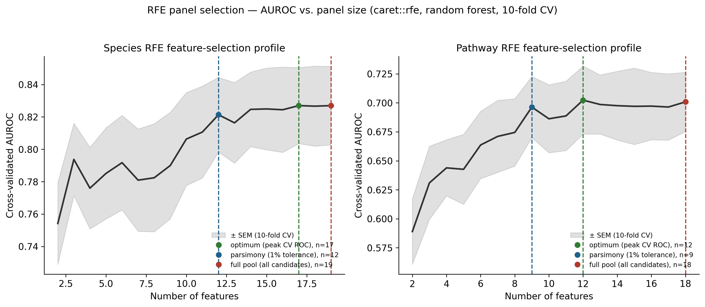

RFE cross-validated AUROC vs. panel size (random forest, 10-fold CV, ±SEM band), species (left) and pathway (right), with the three derived panel sizes marked.
:::

| Feature type | `rfe_optimum` | `rfe_parsimony` (1% tol.) | `rfe_full_pool` |
|---|---:|---:|---:|
| Species | 17 | 12 | 19 |
| Pathway | 12 | 9 | 18 |

Note the species curve is nearly flat from ~12 features onward (0.821 at 12 → 0.827 at 17 → 0.827 at 19) — the parsimonious 12-feature panel captures nearly all of the achievable cross-validated signal, which foreshadows the ML sweep result below (the 17-feature `rfe_optimum` panel wins by only 0.003 AUROC over `rfe_parsimony`).

## 5. Machine learning: model performance

### Winning models per feature type

Across the full sweep (4 model families × 3 panels for species and pathway; 4 model families × 1 panel for combined — 28 nested-CV runs total, 10×5 repeated stratified CV, Optuna-tuned), **ElasticNet won in every feature type**:

| Feature type | Winning config | AUROC | AUPRC | n features |
|---|---|---:|---:|---:|
| Species | ElasticNet, `rfe_optimum` | 0.8325 | 0.888 | 17 |
| Pathway | ElasticNet, `rfe_full_pool` | 0.6916 | 0.787 | 18 |
| Combined | ElasticNet, `rfe_full_pool` | 0.8313 | 0.888 | 37 |

A regularized linear model consistently beating three more flexible nonlinear ensembles, at n≈350 samples and 12–37 features, is itself a finding worth stating plainly: there isn't enough data/signal in this regime for the trees' extra flexibility to pay off, and L1/L2 regularization is doing real work.

**Combining species and pathway barely improves over species alone** (0.8313 vs. 0.8325 AUROC) despite more than doubling the feature count (37 vs. 17) — the added pathway features contribute little beyond what species already captures (confirmed independently by the SHAP analysis below).

::: {#fig-roc}

ROC curves (mean ± 1 SD across 5 CV repeats) for the winning ElasticNet configuration per feature type. Real per-fold out-of-fold predictions (n=353 species / n=352 pathway &amp; combined), not synthetic.
:::

::: {#fig-pr}
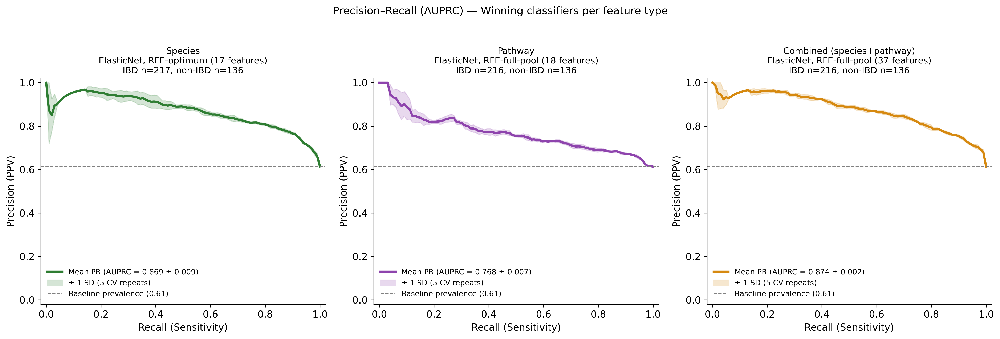

Precision-recall curves for the same three winning configurations, with baseline prevalence shown as a reference line.
:::

::: {#fig-cm}
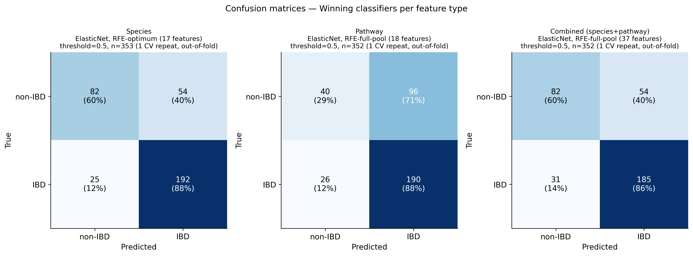

Confusion matrices at the standard 0.5 probability threshold, one representative out-of-fold CV repeat per feature type.
:::

The species classifier correctly identifies 192/217 IBD subjects (88% sensitivity) and 82/136 controls (60% specificity) at the default threshold; the pathway classifier's much lower ceiling is visible directly in its confusion matrix (71% of true controls misclassified as IBD).

## 6. Leave-one-cohort-out (LOCO) validation

Pooled cross-validation cannot rule out a model that has learned cohort identity rather than disease biology — precisely the failure mode the PERMANOVA result (§1) warns is plausible here. LOCO trains on three cohorts and tests entirely on the fourth, held-out cohort (ElasticNet, `rfe_full_pool` panel, per feature type — note this is not necessarily each feature type's pooled-CV *winning* panel, since species' pooled winner was `rfe_optimum`; LOCO fixes `rfe_full_pool` across all three feature types for a controlled comparison).

::: {#fig-loco}
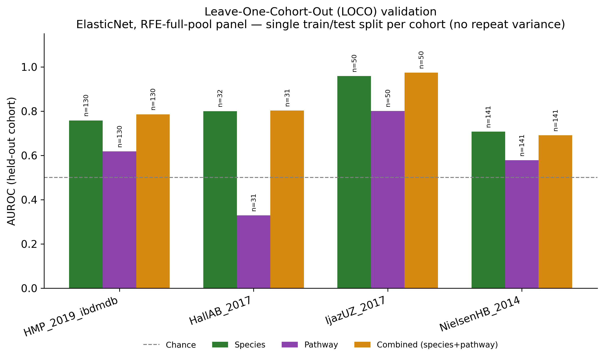

LOCO AUROC by held-out cohort and feature type. Dashed line = chance (0.5). Single train/test split per cohort — no repeat variance is available (unlike the paper convention of n=5 repeated LOCO runs), so no error bars are shown; this is a real limitation of the current LOCO setup, not an omission.
:::

| Held-out cohort | Species AUROC (n test) | Pathway AUROC (n test) | Combined AUROC (n test) |
|---|---:|---:|---:|
| HMP_2019_ibdmdb | 0.758 (130) | 0.618 (130) | 0.786 (130) |
| HallAB_2017 | 0.800 (32) | **0.329 (31)** | 0.803 (31) |
| IjazUZ_2017 | 0.958 (50) | 0.800 (50) | 0.974 (50) |
| NielsenHB_2014 | 0.707 (141) | 0.578 (141) | 0.691 (141) |

*Source: `results/tables/loco_summary_all.csv`.* Species and combined models generalize reasonably across all four held-out cohorts (0.71–0.97 AUROC). The pathway model **collapses to worse than chance on HallAB_2017** (AUROC 0.329, n=31) — the smallest held-out test set among the four cohorts, and consistent with the pathway layer's already-weaker and more test-dependent signal (§3). This is flagged as an honest limitation, not smoothed over.

## 7. Model interpretability: SHAP

SHAP values are available only for the **combined** model (species+pathway, 37 features, n=352) — no separate SHAP run exists per feature type.

::: {#fig-shap}
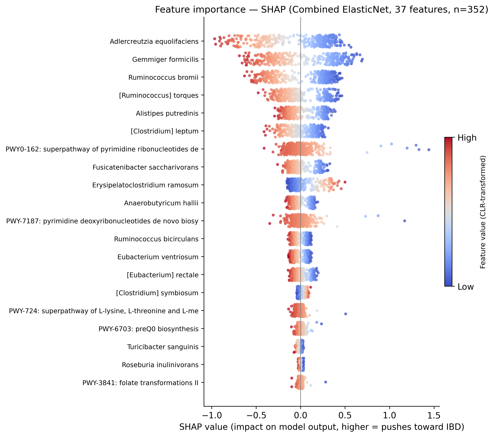

Top-20 SHAP feature importances, combined ElasticNet model. Red = high (CLR-transformed) feature value, blue = low. Positive SHAP value pushes the prediction toward IBD.
:::

**Species features dominate the combined model's predictions: 88.3% of total |SHAP| mass comes from species features, versus 11.7% from pathway features** (`combined_shap_contribution_by_type.csv`) — direct, model-internal confirmation of the near-zero benefit from adding pathway features observed in the AUROC comparison above (§5). The six highest-ranked SHAP features (*Adlercreutzia equolifaciens*, *Gemmiger formicilis*, *Ruminococcus bromii*, *[Ruminococcus] torques*, *Alistipes putredinis*, *[Clostridium] leptum*) are **all** members of the 19-species triple-candidate signature identified independently by the statistical DA pipeline (§3) — convergence between an ML model's learned feature importances and an independently-validated statistical signature, obtained via entirely different methodology, is the strongest piece of corroborating evidence in this project.

## 8. Summary: convergent evidence

Putting the independent lines of evidence side by side:

- **Statistical DA** (3-way MaAsLin2×2 + blocked Wilcoxon convergence): 19 validated species
- **RFE** (`rfe_optimum`, cross-validated AUROC-maximizing subset of those 19): 17 species
- **SHAP** (combined ElasticNet's top-ranked features): top 6 are all triple-candidates
- **ML performance**: the RFE-optimum 17-species ElasticNet panel achieves 0.8325 AUROC pooled, and 0.71–0.96 AUROC across all four LOCO held-out cohorts

Three independently-specified statistical tests, an independent feature-selection procedure, and a fully independent nested-CV/Optuna-tuned classifier trained without any knowledge of the DA results all converge on substantially the same small set of species — *Gemmiger formicilis*, *Ruminococcus bromii*, *Adlercreutzia equolifaciens*, *Alistipes putredinis* foremost among them. That convergence, more than any single AUROC number, is this project's central empirical result.
